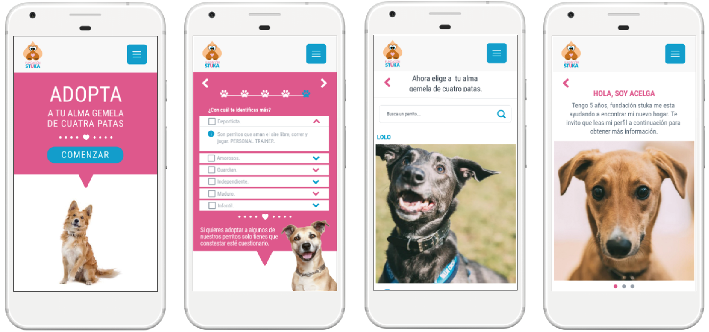

# LittleLaika foundation

The LittleLaika Foundation is an organization that helps animals. We will have shelters in Latin American countries where this problem is being seen the most. We will have a website and an application where animals can be adopted. The project is focused on improving the experience of being able to adopt the puppies.

### Design process

### Objectives
The issue of canine overpopulation is a big problem. Most stray dogs once had an owner who abandoned or lost them. That is why it is important on the website, to deliver all the information of the dogs that are in search of a second chance.

# Descubrimiento e investigación
### Research Cualitativo

It began with the script of the interview to put together a set of questions to prioritize the research topics. 4 interviews were conducted to meet the users and also to find out if they have pets.

Objectives of the questions are:
* Know the motivations of potential adopters.
* How informed are prospective adopters with foundations?
* What are the needs of wanting to adopt?
* How do you look for the information to be able to adopt?
* Know experiences of users who have already adopted
* User experience searching for a pet.

4 users were interviewed; the context of the interviews was randomly chosen on the street or if they were walking their pet.

** Conclusions: **
In the interviews, the users expressed themselves with great affection and love when talking about their pets. How they got to their homes were in circumstances where the dog faces some difficulty, for example in an accident, or malnutrition, that generated empathy of wanting to help and protect them.

### Research Quantitative.
**Market study
**

Information was sought on the Canine population in the Homes.

**Why is a dog adopted?
**
54.8% of households have a dog and 20.9% a cat.
Reasons The profile of pet owners can also be analyzed. The results show that the percentage of pets in families with children is higher than that of families without children or alone. It is common for families with children to have pets not only because of the children, but also because it is easier to take good care of a pet if more people collaborate. People who had pets as children are also more often adopted.

These are, among others, the reasons why you want to adopt a pet:

* For his unconditional love for the owner and other family members.
* Because they do not judge the personality or the appearance of people.
* Because they are faithful companions and can become our best friends.
* Because they're so nice.
* Because they are always happy and they infect us with their good humor.
* For the health benefits of walking and caring for the dog.
* Because they help strengthen the immune system of children and reduce the possibility of developing allergies.
* Because they are playful and fun.
* Because they improve the self-esteem of their owners, especially in the case of children and people who live alone.
* Because when petting and hugging a pet, the stress level is reduced.

**Market study**
According to the Chile 3D 2014 study, 65.3% of Chileans have a pet. 54.8% of those surveyed declared that they had a dog, 20.9% declared that they had a cat and 2.8% declared that they had some other type of pet.
In 2011, PetSmart Charities in the US conducted a market study to examine people's attitudes and behaviors regarding pet adoption. You can acquire a dog or cat in various ways: Going to foundations on the day of adoption. through family members, animal farms, adopting animals that we find abandoned. 19% are adopted from an animal foundation. The main motivations for adopting pets at an animal foundation include the desire to save a life (73%), the search for a special companion (72%), and the desire to reduce the number of stray pets euthanized (72%). The reasons alleged for not adopting in an animal shelter are, among others: wanting a purebred animal (13%), not finding the desired animal (17%), an overly complex adoption process (10%) and finding the right protective of depressing animals or not being able to attend due to time incompatibility (7%).
Bonds There are many reasons to adopt a pet. Some choose a breed that they particularly like or that they think will best suit their lifestyle. Others decide to adopt from an animal shelter because it seems like a way to help. Regardless of the origin of a pet, most owners establish a close bond with it, see it as a member of the family and enjoy many of the benefits previously listed.

### Benchmark

Los sitios Web internacionales observados se puede apreciar en su portales de adopciones. Que al presentar, características de cada perrito son hablados en primera persona, el animal expresando su historia cómo llegó a la organización y las condiciones que se encuentra.

# Síntesis y definición
### User Persona - Arquetipos

Elabore **User personas** enfocados en en un usuario que tienen mascotas. Para comprender más las necesidades de los usuarios al momento de querer adoptar.

### User Journey Map

Se realizó un mapa de viaje, para identificar los puntos críticos de los usuarios en las diferentes etapas de cuando quieren adoptar un perro en el sitio web actual de la fundación. De acuerdo a la investigación del testing vídeo.

### Problem Statement

A partir del Customer Journey Map se definieron las principales necesidades de los usuarios.
* Se necesita cumplir ciertas características para poder adoptar un perro.

### HMW / What if?
Luego del planteamiento del problema se definieron las preguntas claves ¿Cómo podríamos? (HMW) (What if?), estas preguntas sirvieron para entender más los problemas y desarrollar mejores hipótesis. 
* Qué pasaría si existiera filtros para categorizar por tamaños, sexo y personalidad entre otros.
* Qué pasaría si mostrarán fotografías de los perros en sus diferentes vistas.
* Qué pasaría si en el sitio hubiera una reseña de cómo llegó el perrito a la fundación.
* Qué pasaría si aparezca los perros que ya están en proceso de adopción.
* Qué pasaría si aparece vídeos de los perros de la fundación.
* Qué pasaría que pudieran también apadrinar a un perro de la fundación.
* Qué pasaría si la descripción del perro se presentará de una manera lúdica y hablada en primera persona, es el perro contando su historia.

# Ideación
### Propuesta de Valor

* Enfocado en la búsqueda de adoptar, pero de una manera simple, iniciara en el home del sitio web, donde invitan a comenzar la búsqueda respondiendo un cuestionario.

### Arquitectura de la información
La arquitectura de la información me ayudó a organizar, etiquetar y diseñar el contenido que tendrá el sitio web. Esto me permite dar estructura, completar objetivos y dar sentido a la información. 

### User flow y Testing
Se utilizó user flow para determinar el trayecto que realizarán los diferentes usuarios. Al momento de iniciar una búsqueda de los perros en adopción en la fundación. 

Los wireframes fue testeado por funcionarios de la fundación en donde lograron realizar la tarea asignada:
* Responder el cuestionario de acuerdo a los criterios de un supuesto adoptante
* Adoptar a Acelga una perrita de la fundación.

Se reafirma la hipótesis de entregar mayor información y características de los perros en adopción, ya que en la actualidad la voluntaria de las adopciones del sitio web, al momento de comunicarse con ella son los mismos posibles adoptantes le solicitan más fotografías de los perros, la historia de cómo llegó el animal o vídeo de él.

# Prototipo de alta fidelidad
Las observaciones hechas en el testing fueron corregidas, para así mejorar la experiencia del usuario al momento de iniciar la búsqueda de un perro en adopción. Este nuevo prototipo fue hecho con la herramienta Marvelapp.

