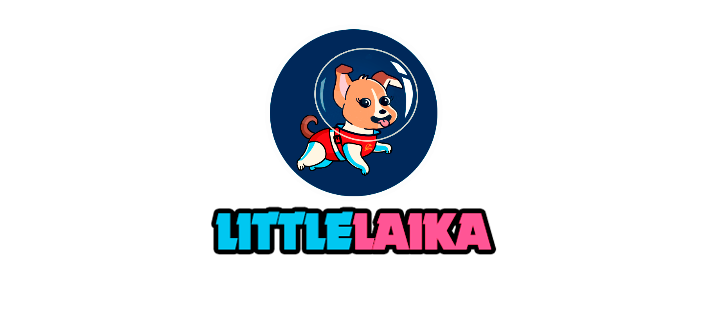
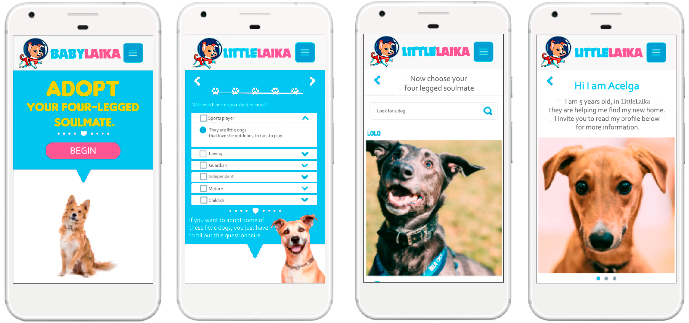
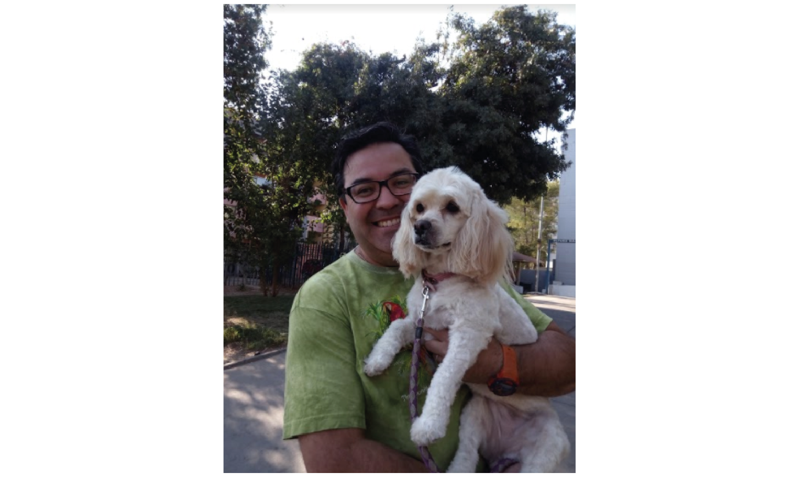
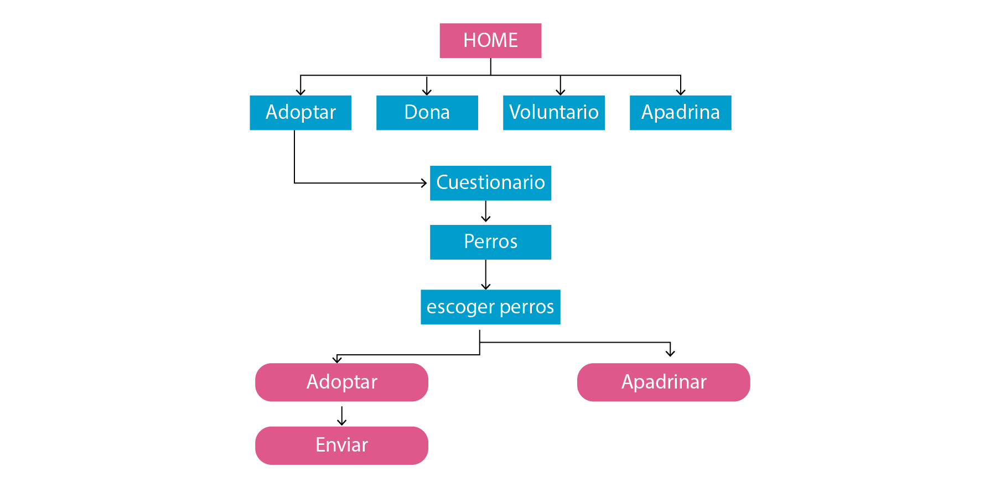
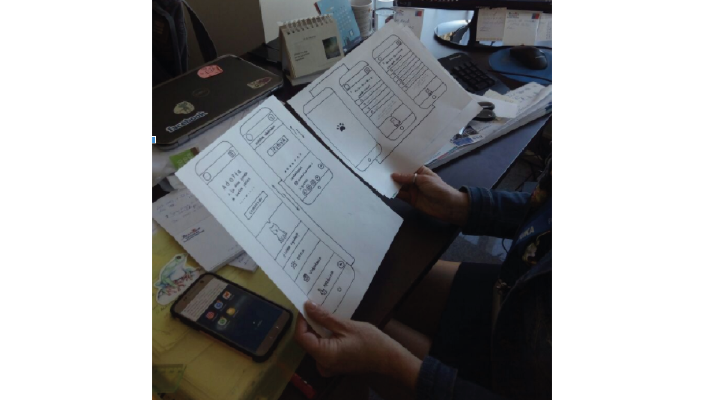
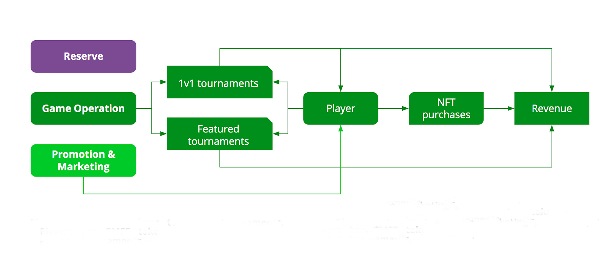
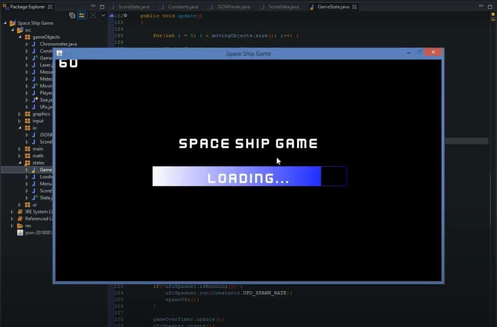

### *WHITEPAPER

# LittleLaika foundation

The LittleLaika Foundation is an organization that helps animals. We will have shelters in Latin American countries where this problem is being seen the most. We will have a website and an application where animals can be adopted. The project is focused on improving the experience of being able to adopt the puppies.
It should be noted that the development of the project will begin in Latin America, so there are Latin people from Chile, Peru and Mexico in the development team. The field study was carried out in Latin countries.

### Design process

### Objectives
The issue of canine overpopulation is a big problem. Most stray dogs once had an owner who abandoned or lost them. That is why it is important on the website, to deliver all the information of the dogs that are in search of a second chance.

# Discovery and research

### Research Cualitativo

It began with the script of the interview to put together a set of questions to prioritize the research topics. 4 interviews were conducted to meet the users and also to find out if they have pets.

Objectives of the questions are:
* Know the motivations of potential adopters.
* How informed are prospective adopters with foundations?
* What are the needs of wanting to adopt?
* How do you look for the information to be able to adopt?
* Know experiences of users who have already adopted
* User experience searching for a pet.

4 users were interviewed; the context of the interviews was randomly chosen on the street or if they were walking their pet.

** Conclusions: **
In the interviews, the users expressed themselves with great affection and love when talking about their pets. How they got to their homes were in circumstances where the dog faces some difficulty, for example in an accident, or malnutrition, that generated empathy of wanting to help and protect them.

### Research Quantitative.
**Market study
**

Information was sought on the Canine population in the Homes.

**Why is a dog adopted?
**
54.8% of households have a dog and 20.9% a cat.
Reasons The profile of pet owners can also be analyzed. The results show that the percentage of pets in families with children is higher than that of families without children or alone. It is common for families with children to have pets not only because of the children, but also because it is easier to take good care of a pet if more people collaborate. People who had pets as children are also more often adopted.

These are, among others, the reasons why you want to adopt a pet:

* For his unconditional love for the owner and other family members.
* Because they do not judge the personality or the appearance of people.
* Because they are faithful companions and can become our best friends.
* Because they're so nice.
* Because they are always happy and they infect us with their good humor.
* For the health benefits of walking and caring for the dog.
* Because they help strengthen the immune system of children and reduce the possibility of developing allergies.
* Because they are playful and fun.
* Because they improve the self-esteem of their owners, especially in the case of children and people who live alone.
* Because when petting and hugging a pet, the stress level is reduced.

**Market study**
According to the Chile 3D 2014 study, 65.3% of Chileans have a pet. 54.8% of those surveyed declared that they had a dog, 20.9% declared that they had a cat and 2.8% declared that they had some other type of pet.
In 2011, PetSmart Charities in the US conducted a market study to examine people's attitudes and behaviors regarding pet adoption. You can acquire a dog or cat in various ways: Going to foundations on the day of adoption. through family members, animal farms, adopting animals that we find abandoned. 19% are adopted from an animal foundation. The main motivations for adopting pets at an animal foundation include the desire to save a life (73%), the search for a special companion (72%), and the desire to reduce the number of stray pets euthanized (72%). The reasons alleged for not adopting in an animal shelter are, among others: wanting a purebred animal (13%), not finding the desired animal (17%), an overly complex adoption process (10%) and finding the right protective of depressing animals or not being able to attend due to time incompatibility (7%).
Bonds There are many reasons to adopt a pet. Some choose a breed that they particularly like or that they think will best suit their lifestyle. Others decide to adopt from an animal shelter because it seems like a way to help. Regardless of the origin of a pet, most owners establish a close bond with it, see it as a member of the family and enjoy many of the benefits previously listed.

### Benchmark

The observed international websites can be seen on their adoption portals. That when presenting, characteristics of each puppy are spoken in the first person, the animal expressing its history, how it came to the organization and the conditions it is in.

### User Journey Map

A travel map was made to identify the critical points of the users in the different stages of when they want to adopt a dog.

### Problem Statement

Based on the Customer Journey Map, the main needs of the users were defined.
* You need to meet certain characteristics to be able to adopt a dog.

### HMW / What if?
After posing the problem, the key questions were defined: How could we? (HMW) (What if?), These questions served to better understand the problems and develop better hypotheses.
* What if there were filters to categorize by size, sex and personality among others.
* What if they show pictures of the dogs in their different views.
* What if the site had a review of how the puppy came to the foundation.
* What would happen if the dogs that are already in the adoption process appear.
* What would happen if videos of the foundation's dogs appear.
* What if they could also sponsor a dog from the foundation.
* What if the description of the dog is presented in a playful and spoken way in the first person, it is the dog telling his story.
# Ideation
### Value proposal

* Focused on the search to adopt, but in a simple way, it will start at the home of the website, where they invite you to start the search by answering a questionnaire.

### Information architecture

The information architecture helped us organize, tag and design the content that the website will have. This allows us to give structure, complete objectives and make sense of the information.

### User flow y Testing
User flow was used to determine the path that the different users will take. When starting a search for dogs for adoption at the foundation.

The wireframes were tested by officials of the foundation where they managed to perform the assigned task:
* Answer the questionnaire according to the criteria of a supposed adopter
* Adopt Acelga, a dog from the foundation.

The hypothesis of providing more information and characteristics of the dogs for adoption is reaffirmed, since at present the voluntary adoptions of the website, at the time of communicating with her, are the same possible adopters requesting more photographs of the dogs, the story of how the animal arrived or video of it.

# High fidelity prototype

The observations made in the testing were corrected, in order to improve the user experience when starting the search for a dog for adoption. We are doing this new prototype with the Marvelapp tool.

# About the cryptogame platform
The LAIKA-GAME platform consists of:
* Rewards application (phase 1): game entertainment with more than 80 casual style games registered in web and mobile applications in the App Store and Google Play; The LITTLELAIKA token will be featured as a reward for players and a way to onboard the current free-to-play audience on the blockchain.

* Dogs-NFT (Phase 2) - Dog-themed game set that will use L-Dogs NFT as game characters in their own dedicated games, with the Littlelaika token used to purchase and upgrade the L-Dogs.

### Token utility
The $ Littlelaika token allows holders to participate in skill-based tournaments, buy and upgrade L-Dogs NFT and participate in the ecosystem governance layer that allows voting on the platform roadmap, new game content and the creation of accumulated prizes.

*Game payments and entry fees
Players will need Littlelaika tokens to pay an entry fee to all skill-based tournaments and L-Dog games.

*NFT purchase
Players will need LittleLaika to purchase L-Dogs and purchase game packs.

*NFT updates
Players will pay with LittleLaika to upgrade their L-Dog and increase overall power and stats.

*Staking
Betting on L-Dogs will allow its owner to earn rewards at LittleLaika.
LittleLaika will allow holders to participate in decisions about the features and content of the platform.

*Governance
Voting rights can be exercised over the game roadmap, the presentation of game content in dedicated Game Plots and the distribution of accumulated prizes.

# First game to be released "space-ship".
We present "space ship" will be one of the first games we will launch. Currently this game is in Alpha version but we will soon have in Beta to share it with the community.

### Thematic

The game tries to dodge and destroy asteroids and ships that will appear throughout the game, for destroying enemy ships you will receive more points which will allow you to accumulate them and thus be able to rise in levels. In each game you can collect rewards, tools that will help you throughout the game.

### How to earn money in "space ship"?

The player will win money every time he levels up:
* From level 1 to level 2: 10 usd
* From level 2 to level 3: 20 usd
* From level 3 to level 4: 30 usd
* From level 4 to level 5: 40 usd
* From level 5 to level 6: 50 usd
* From level 6 to level 7: 60 usd
* From level 7 to level 8: 70 usd
* From level 8 to level 9: 80 usd
* From level 9 to level 10: 140 usd

### Game controls
Use the arrow keys to scroll. To shoot press the P key

# Road map

* Stage 1

-Team Building 
-Website launch
-Twitter / Telegram / Reddit Marketing
-Build a strong community
-Listing on Pancakeswap
-Update logo BscScan
-Advertising on Poocoin
-Top 1 trending DexTools
-Apply for CoinGecko at 1000 holders
-Apply for CMC at 2500 holders

* Stage 2

-Develop all our Social Media (Twitter, Instagram, Facebook, TikTok, GitHub, Medium, Reddit, etc.)
-Ama's
-First Audit
-Website revamp
-Reinforced Marketing on Tiktok, Twitter, Youtube and other social mediad
-Top trending on DexTools
-Creating our own charity platform
-10,000 holders
-Reach to 8,000 Telegram users
-Arrive to 10M USD MarketCap

* Stage 3

-Actualization of the web site
-Launch of the application in playstore. Launch of the staking and farming platform.
-Contact with the other foundations of aid for the animals, so that they join the project.
-Listing in several CEX exchanges.
-Aggressive marketing campaign (hot influencers, billboards, hire marketing service)
-Partnerships and Ambassadors
-Official Merchandising
-Be as more popular as we can in Youtube channels
-Market tokens burn
-15,000 holders
-Reach to 12,000 Telegram users
-Arrive to 25M USD MarketCap

* Stage 4

-Launch of the cryptogame platform.
-Launch of the L-Dogs nft platform
-More things coming... If you join us, you will know.
